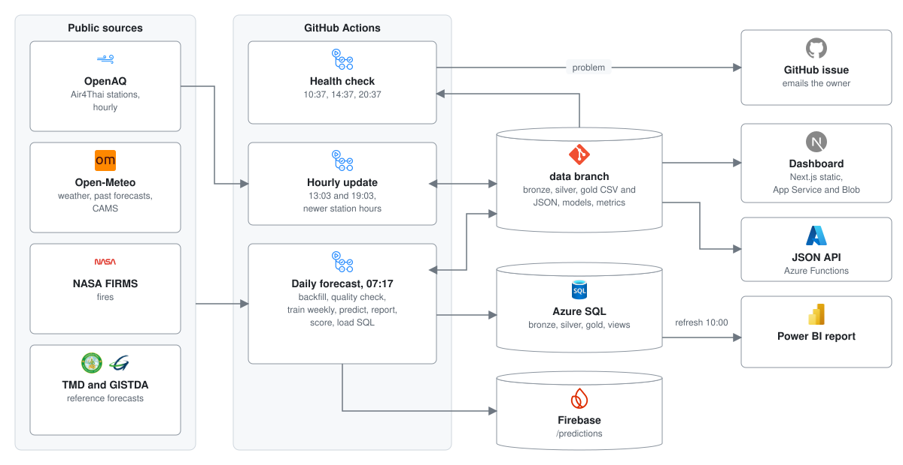

# Bangkok PM2.5 and PM10 Forecast

A pipeline that collects public air quality and weather data, forecasts PM2.5, PM10, temperature and humidity for Bangkok, and serves the forecast through a dashboard, a JSON API and Power BI. GitHub Actions runs it every day; nothing runs on a server of its own.

It forecasts the next seven days as daily means (city-wide and for 20 reference stations) with a range and the chance of going above the Thai PM2.5 standard, each hour to the end of tomorrow, and the next three calendar months as monthly means. Each station has its own page on the dashboard. The results so far are summarised in [docs/results.md](docs/results.md).

## Architecture

<p align="center"></p>

The diagram is drawn by `docs/architecture.py`; edit the layout there and run it again.

Every job reads the `data` branch, adds to it and writes it back as a single commit, so the branch is the only state. The dashboard and the API read it directly, so a new forecast appears without a deploy. Azure is optional: without it, the forecast, the dashboard on GitHub Pages and the JSON on the `data` branch keep working.

| Time (Bangkok) | Job | What it does |
|---|---|---|
| 07:17 | Daily forecast | Fetches missing hours, checks data quality, retrains weekly, forecasts, scores past forecasts, loads Azure SQL |
| 10:00 | Power BI refresh | Imports the views from Azure SQL |
| 10:37 | Health check | Opens a GitHub issue if any output is missing or stale |
| 13:03 | Hourly update | Repeats the hourly forecast with station hours up to 09:00, adds TMD values the morning missed |
| 14:37 | Health check | Also checks that the afternoon hourly update used hours up to 09:00 |
| 19:03 | Hourly update | Repeats it again with hours up to 16:00 |
| 20:37 | Health check | Also checks that the evening hourly update used hours up to 16:00 |
| Mon 09:07 | Weekly summary | Posts a GitHub issue: the week's measurements, live scores, chances, alerts, failed runs and the coming week |

| Module | Responsibility |
|---|---|
| `pm25.ingest` | Fetches only the hours missing locally, stores them as UTC CSV, never duplicates a row |
| `pm25.features` | Builds daily targets and features that only use information known at forecast time |
| `pm25.evaluate` | Walk-forward splits, metrics and the promotion gate |
| `pm25.train` | Compares models with baselines and decides what each forecast slot publishes |
| `pm25.predict` | Builds the forecast document |
| `pm25.publish` | Writes the document to Firebase in one atomic request |
| `pm25.hourly` | Hourly city forecast for the morning, afternoon and evening runs |
| `pm25.station_model` | Pooled per-station forecasts for seven days |
| `pm25.monitor` | Scores every published forecast against what was measured |
| `pm25.warehouse` | Loads the layers into Azure SQL and reads back what it holds |
| `pm25.served` | Keeps each forecast's inputs and compares them with the stored data later |
| `pm25.weekly` | Writes the Monday summary issue |
| `pm25.health` | Decides whether today's outputs are fresh and trustworthy |

## Live dashboard


- Main: https://app-pm25-forecast-1716.azurewebsites.net (Azure App Service, free F1 plan)
- Backup: https://stpm25webd0b881.z23.web.core.windows.net (Azure Blob Storage static website)

Pages: the forecast with Thai air quality colours (PCD scale) and a station map, `/station/?id=<location>` for one station (its last 14 days, its seven-day forecast and how its forecasts have done, linked from the map), and `/accuracy/` with live accuracy. Both have Thai and English text (`?lang=th` or `?lang=en`, or the switch at the top).

Both sites serve the same Next.js static export from `web/` (TypeScript, React, Chart.js). The page is plain files with no server, and it fetches the `data` branch in the browser, so each morning's forecast appears without a rebuild. Types in `web/lib/types.ts` mirror the forecast document, so a schema change on the Python side fails the TypeScript build. `deploy-dashboard-pages.yml` publishes the same build to GitHub Pages once Azure is removed.

To work on the dashboard locally:

```bash
cd web
npm ci
npm run dev      # http://localhost:3000
npm test
npm run build    # static files in web/out
```

## API

A read-only JSON API runs on Azure Functions (TypeScript, `api/`). It serves the same files as the dashboard from the `data` branch, cached for 10 minutes, with CORS open to any site.

Base URL: https://func-pm25-api-d0b8.azurewebsites.net/api

| Endpoint | Returns |
|---|---|
| `/help` | The list of endpoints |
| `/forecast` | The next seven days, the next three months, and each station |
| `/hourly` | Hourly PM2.5 and PM10 to 23:00 tomorrow: from 04:00 after the morning run, from 10:00 after the afternoon update, from 17:00 after the evening update |
| `/measured?target=pm25&from=2026-11-01&to=2026-11-12` | Measured Bangkok daily values; `target` is `pm25`, `pm10`, `temp_c` or `rh_pct` |
| `/forecasts?target=pm25&label=tomorrow&from=…&to=…` | Every published daily forecast in the range; labels `today`, `tomorrow`, `day2` to `day6` |
| `/accuracy` | Live accuracy over 7, 30 and 90 days |
| `/stations` | Daily values per reference station for the last 14 days |

Ranges default to the last 30 days and can cover at most 400 days. Bad parameters return 400 with a message. `.github/workflows/deploy-api.yml` tests, builds and deploys on every change to `api/`. After Azure ends, the same JSON stays available directly from the `data` branch on raw.githubusercontent.com.

## Azure resources

Everything lives in one resource group, `rg-pm25-forecast`, on an Azure for Students subscription, so it can be deleted in one step without affecting the pipeline.

| Resource | Purpose | Cost |
|---|---|---|
| Azure SQL Database, free tier, serverless | Warehouse with `bronze`, `silver` and `gold` schemas and views for Power BI | Free; pauses instead of billing when the monthly allowance is used |
| App Service plan F1 and web app | Main dashboard | Free |
| Storage account, static website | Backup dashboard, and the Functions deployment package | Free for 12 months, then a few cents |
| Function app, Flex Consumption (`func-pm25-api-d0b8`) | Public read-only API, at most 10 instances of 512 MB, no Application Insights | Monthly free grant of 250,000 executions and 100,000 GB-s per subscription |
| User-assigned managed identity | GitHub Actions signs in with OIDC, scoped to these resources only | Free |

The database accepts Microsoft Entra sign-in only. CI opens the SQL firewall for its own address during the load and removes the rule afterwards. Azure steps never block the forecast or the Firebase publish.

## Data

| Source | Role | Data | Access |
|---|---|---|---|
| OpenAQ, Air4Thai reference monitors | Forecast target | Hourly PM2.5 at 20 stations and PM10 at 8; the city value uses a fixed panel of 10 and 3 of them | Free API key |
| Open-Meteo Air Quality | Feature | PM2.5, NO2, O3, SO2 and CO from the CAMS global model | No key |
| Open-Meteo Historical Weather | Feature, and the target for temperature and humidity | Temperature, humidity, precipitation and wind from 2021 | No key |
| TMD Weather Forecast API | Reference shown next to our forecast | Hourly temperature and humidity forecast, 3 km model | Free token |
| Open-Meteo Previous Runs (JMA model) | Feature | The weather forecast for the target day as it was issued one to seven days before: temperature, humidity, rain, wind, pressure and cloud, from 2021 | No key |
| Open-Meteo Air Quality forecast (CAMS) | Archived for later | Each morning's CAMS PM2.5 forecast for today and tomorrow, saved to `bronze/cams_forecast_archive.csv` | No key |
| GISTDA PM2.5 (pm25.gistda.or.th) | Reference shown next to our forecast | Bangkok hourly and 24-hour average PM2.5 estimated from satellite data and a model | No key; the website's own endpoint, no published API contract, so an outage only drops the reference |
| NASA FIRMS (VIIRS NOAA-20) | Feature, optional | Daily fire detection count and total fire radiative power in a box over central Thailand, western Cambodia and the Myanmar border (97.5–105.5 E, 11.5–17.5 N) | Free MAP_KEY |

The daily target is the median across a fixed panel of stations, so one faulty station cannot move it. A station-day needs 18 hours of data, and a city-day needs at least 5 PM2.5 stations or 2 PM10 stations. Days are Bangkok local days. Gaps in the measured target are never filled with model data.

Ten more Air4Thai stations (five with PM10) were added on 19 November 2026 for the station map and the per-station models. Each reported on at least 90 % of days over the previous year. They are kept out of the city median, so the city series the daily models learn from is unchanged.

Modelled PM10 from Open-Meteo is not used, because its ratio to PM2.5 changes abruptly in November 2024.

The target-day weather forecast uses the Previous Runs API, which returns each hour as forecast one or two days earlier, so training never sees hindsight. Today's forecast uses runs from one day before and tomorrow's from two days before; both runs exist before the 07:17 job starts. Past CAMS air quality forecasts are not available anywhere free, so the pipeline archives them from now on, to be tested as a feature once about a year has built up.

Fire detections are stored as hourly totals (count and FRP), not single detections, so the file stays small. Archive (standard processing) data is used where it exists and near real time data after it. Days that were never fetched stay missing rather than zero. The fire features only reach a published forecast if a model trained with them passes the promotion gate. Each promoted model records its feature list, so models saved before the fire features existed keep working.

## Run locally

### Requirements

Python 3.12 or newer. Library versions are pinned in `requirements.txt`, so every install gets the same versions.

| Library | Used for |
|---|---|
| pandas, numpy | Data handling |
| scikit-learn, joblib | Models and saving them |
| matplotlib | Evaluation plot and PDF report |
| requests | Calls to OpenAQ, Open-Meteo and Firebase |
| google-auth | Service account login for Firebase publishing |
| pytest | Tests (`requirements-dev.txt`) |

### Install

macOS or Linux:

```bash
python3.12 -m venv .venv
source .venv/bin/activate
pip install -r requirements.txt -r requirements-dev.txt
pip install -e . --no-deps
pytest
```

Windows (PowerShell):

```powershell
py -3.12 -m venv .venv
.venv\Scripts\Activate.ps1
pip install -r requirements.txt -r requirements-dev.txt
pip install -e . --no-deps
pytest
```

If PowerShell refuses to run the activation script, allow local scripts for your user once:

```powershell
Set-ExecutionPolicy -Scope CurrentUser RemoteSigned
```

The last install line makes the `pm25` package and its `python -m pm25` commands available. On macOS and Linux, `make install` and `make test` do the same.

### Run

Create your settings file, then open `.env` and fill in the values. Commands read `.env` automatically, so there is nothing to load by hand.

macOS or Linux:

```bash
cp .env.example .env
```

Windows (PowerShell):

```powershell
Copy-Item .env.example .env
```

Then run the pipeline with the virtual environment active. These commands are the same on every platform:

```bash
python -m pm25 backfill
python -m pm25 train
python -m pm25 predict
python -m pm25 report
python -m pm25 monitor   # score published forecasts against measurements
python -m pm25 health    # exit 1 if today's outputs are stale or failing
python -m pm25 publish
```

`publish` is optional and needs Firebase credentials. On macOS and Linux, `make pipeline` runs backfill, train, predict and report in one go. Values already set in the shell or in CI take priority over `.env`.

The first OpenAQ load takes about 30 minutes because requests are paced for the free tier. Later runs only fetch new hours.

## Automation

`.github/workflows/daily-forecast.yml` runs the pipeline every morning and can also be started by hand (`workflow_dispatch`).

| Setting | Value |
|---|---|
| Schedule | 00:17 UTC, which is 07:17 in Bangkok; GitHub may start it some minutes late |
| Overlap | A concurrency group stops two runs overlapping |
| Timeout | 120 minutes, for the first load of a new data source |
| State | Data, models and reports live on a `data` branch that always holds a single commit |
| Daily report | Markdown, CSV and PDF in the run summary and the `daily-report-<date>` artifact, kept 30 days |
| Report history | `reports/<date>.md` and `reports/forecast_history.csv` on the `data` branch |
| Model artifacts | Model, registry and metrics, kept 7 days |

Repository secrets: `OPENAQ_API_KEY`, `TMD_API_TOKEN` (optional), `FIRMS_MAP_KEY` (optional), `FIREBASE_DB_URL` and `FIREBASE_SERVICE_ACCOUNT_JSON` (the JSON key of a service account with the Firebase Realtime Database Admin role).

### Live accuracy and alerts

`python -m pm25 monitor` runs after the report. It joins every published daily forecast in `gold/forecast_history.csv` with the measured value once it exists, and compares it with persistence as it stood on the day the forecast was issued. It writes `gold/live_accuracy.csv` (one row per scored forecast) and `gold/live_accuracy_summary.json` (MAE, persistence MAE, skill and range coverage over 7, 30 and 90 days). If the published forecast for a target is worse than persistence over 30 days with at least 14 scored days, and a one-sided paired t-test on the daily error differences gives p < 0.05, the summary carries an alert. With 15 to 30 scored days a small gap is often luck, so the test keeps it from alerting.

The hourly forecast and the per-station forecasts are scored the same way. Each run appends them to `gold/hourly_forecast_history.csv` and `gold/station_forecast_history.csv`; `monitor` writes `gold/live_accuracy_hourly.csv` and `gold/live_accuracy_stations.csv` and adds `hourly` and `stations` sections to the summary. The hourly baseline is the same hour of the previous day as known at 03:00; the station baseline is the station's own last measured day. The afternoon hourly update, hourly PM10 and the PM10 station forecasts are scored separately, as `hourly_afternoon`, `hourly_pm10`, `hourly_pm10_afternoon` and `stations_pm10`.

`.github/workflows/health-check.yml` runs at 10:37, 14:37 and 20:37 Bangkok time on the `data` branch. It raises an alert when no forecast was published today, the newest complete station day is more than two days old, the data quality gate failed, the live accuracy summary carries an alert, today's hourly forecast (with PM10) is missing or uses older hours than the run due by then (03:00 in the morning, 09:00 after 14:30, 16:00 after 20:30), no station has a forecast for one of the seven days, or a published daily model was trained on a different feature list from the newest model of the same target and no retrain has judged it since. Every daily forecast also saves the feature rows it used (`gold/served_features.csv`, one row per horizon); the scoring step rebuilds the same rows from the stored data for the last 14 days and writes the differences to `gold/served_feature_check.json`, which the weekly summary lists. Weather forecast inputs are expected to differ, because a past day's forecast is later replaced by the run issued the right number of days before it; any other difference means training and forecasting saw different data. The live accuracy summary alerts when a published forecast is clearly worse than persistence over 30 days (paired t-test, p < 0.05), and when an 80 % range (city, station or hourly) held so few outcomes over the last 30 days, with at least 14 days scored, that a range truly holding 80 % would do that badly less than 5 % of the time (binomial test, counting days, since hours of one day miss together). An alert opens a GitHub issue labelled `pipeline-health` (or comments on the open one), which emails the repository owner; the next healthy run closes it. GitHub also emails the owner when a scheduled run fails.

`python -m pm25 alert` is a scaffold for public alerts when tomorrow's PM2.5 is above the Thai standard. See [docs/alerts.md](docs/alerts.md).

Cost and limits for a public repository: GitHub-hosted standard runners are free with no minute limit. Scheduled runs can start late when GitHub is busy, and GitHub disables schedules in public repositories after 60 days without repository activity. Artifacts can be kept up to 90 days; this workflow keeps them 7.

Recommended Realtime Database rules, which let anyone read forecasts and nobody write except the service account:

```json
{
  "rules": {
    ".read": false,
    ".write": false,
    "predictions": { ".read": true, ".write": false }
  }
}
```

## Forecast document

`/predictions/latest` and `/predictions/history/<date>` hold the same document:

```json
{
  "schema_version": 1,
  "as_of": "2026-11-11",
  "latest_data_date": "2026-11-10",
  "data_age_days": 0,
  "status": "ok",
  "units": "ug/m3",
  "daily": [
    {"date": "2026-11-12", "label": "tomorrow", "pm25": 21.1, "pm25_low": 13.7, "pm25_high": 28.5, "pm25_method": "random_forest", "pm10": 34.6, "...": "..."}
  ],
  "monthly": [
    {"month": "2026-12", "months_ahead": 1, "pm25": 30.0, "pm25_low": 25.0, "pm25_high": 35.0, "pm25_method": "climatology", "...": "..."}
  ]
}
```

`status` becomes `stale` and values become `null` when the latest station data is older than the forecast origin. The range covers 80 % of past out-of-sample errors. Temperature rows also carry `temp_c_model` and `temp_c_bias`, the forecast before and the amount of the bias correction (see Forecast ranges).

## Model card

### What each forecast uses

Each target and horizon is a slot. A slot publishes a fitted model only after the model passes the promotion gate; otherwise it publishes the best baseline. The gate runs daily, so the published method can change. The table shows the run of 2026-11-25, the first with models of the change from the last known value ("change").

| Slot | Published method |
|---|---|
| PM2.5 today | Random forest, change |
| PM2.5 tomorrow | Gradient boosting, change |
| PM10 today, tomorrow and the day after | Random forest, change |
| Temperature today to the day after tomorrow | Gradient boosting, change |
| Humidity today and tomorrow | Gradient boosting, change |
| Other days 3 to 7 | Random forest or gradient boosting of the level, by slot |
| Monthly PM2.5 and PM10, 1 to 3 months ahead | Climatology (mean of the same calendar month) |
| Monthly temperature and humidity | Climatology or damped anomaly, whichever passes the gate |

Temperature and humidity are trained and scored against Open-Meteo history from 2021, which is a model reanalysis and not a station measurement. Compared with station records from 2023 to 2026, it reads about 1 °C cooler than central Bangkok. Measured temperature that is free and updated daily was not found.

The Thai Meteorological Department (TMD) forecast for today and tomorrow is published next to ours as `tmd_*` fields. It is an independent 3 km weather model, and its accuracy against Bangkok stations has not been measured here. TMD publishes its new run around 07:45, after the daily job starts, so the morning run often has today's values only. The afternoon update (`tmd-refresh`) adds the missing days and never changes values already published.

### How it is evaluated

- Walk-forward, expanding window, never shuffled. The first test block starts one year after the data begins. Each 30-day block is predicted by a model trained only on rows whose outcome was known before the block started.
- Every method is scored on the same rows, so a method cannot look better by skipping hard days.
- Baselines: persistence (yesterday), seven-day seasonal naive (same weekday last week), and for monthly forecasts, climatology.
- Promotion gate: a candidate must cut MAE by at least 1 % against every baseline over the latest 90 days and over all folds. The candidates are random forest and gradient boosting, each as a model of the level; for today to two days after tomorrow also as a model of the change from the last known value; and for PM2.5 and PM10 three to six days ahead also as a blend, half the model and half the mean of the last seven days. Candidates are tried in order of MAE over all folds, and the first that passes is published. Only when none passes is the published model kept or a baseline used. Until 25 November 2026 the next candidate was tried only when no model was published, so a slot could keep an older model while another candidate beat every baseline on both windows (PM2.5 two days after today: gradient boosting 3.61 against the weekly mean's 3.94 on the newest 90 days, never tried). If a model is already published, the candidate must also beat it on days that model never trained on, and at least 14 such days must exist. A published model trained on a different feature list (saved before a feature was added), or chosen before a candidate was added, is not protected this way: the candidate replaces it if it passes the gate against the baselines. Until 20 November 2026 this exception did not exist, so from 13 to 20 November seven slots (PM2.5, PM10 and temperature today and tomorrow, humidity tomorrow) published models without the weather forecast features while the walk-forward numbers here describe models with them. Live scores for those days reflect the older models. On the days the older models never saw, the newer ones missed temperature tomorrow by 0.95 °C instead of 1.42 and humidity tomorrow by 6.1 % instead of 8.0; for PM the nine days were too few to tell. The health check now reports any daily model on an older feature list.
- Tests check that no feature uses data after its forecast origin and that walk-forward training never sees a test-period outcome.
- Training takes about half an hour, so the daily job runs `train --max-age-days 7`: it refits only when the saved models are a week old or a forecast slot is missing from the registry. Predictions still use each day's newest data. Running the workflow by hand with `retrain` ticked trains at once. The 14-day rule above means a refit model rarely replaced the published one more often than this anyway.

### Results

Out-of-sample walk-forward results from the 2026-11-11 run. Air quality slots cover about 1,150 days and weather slots about 1,650 days, ending November 2026. Skill is the share of persistence error removed.

| Slot | Best model | MAE | RMSE | R² | Persistence MAE | Skill |
|---|---|---|---|---|---|---|
| PM2.5 today (µg/m³) | Gradient boosting | 3.21 | 4.61 | 0.81 | 3.45 | 7 % |
| PM2.5 tomorrow (µg/m³) | Random forest | 4.64 | 6.52 | 0.63 | 5.28 | 12 % |
| PM10 today (µg/m³) | Random forest | 4.81 | 6.78 | 0.81 | 4.89 | 2 % |
| PM10 tomorrow (µg/m³) | Random forest | 6.89 | 9.46 | 0.62 | 7.47 | 8 % |
| Temperature today (°C) | Random forest, not published | 0.59 | 0.78 | 0.79 | 0.59 | 1 % |
| Temperature tomorrow (°C) | Random forest | 0.83 | 1.07 | 0.59 | 0.86 | 3 % |
| Humidity today (%) | Random forest, not published | 3.50 | 4.68 | 0.82 | 3.44 | −2 % |
| Humidity tomorrow (%) | Random forest | 4.81 | 6.37 | 0.66 | 4.89 | 2 % |

PM2.5 tomorrow by season of the target date (MAE, model against persistence): cool haze season November to February 7.0 against 8.4, hot season March to May 5.7 against 5.8, rainy season June to October 2.7 against 3.2.

Monthly errors over 25 to 27 out-of-sample months for air quality and about 40 months for weather: MAE 2.8 to 3.0 µg/m³ for PM2.5, 4.4 to 4.5 µg/m³ for PM10, 0.8 °C for temperature and 3.5 to 3.7 % for humidity.

For context, the Open-Meteo CAMS value for the same day, which is hindsight rather than a forecast, has a PM2.5 MAE of 11.0 against the station panel. The model reads high for Bangkok.

### Feature experiments

Each addition was tested on the same walk-forward folds, with and without it. MAE of the best candidate over all folds, measured on 2026-11-13 to 2026-11-16 (the last four rows on 2026-11-25, with more data, so their starting values differ):

| Addition | PM2.5 today | PM2.5 tomorrow | PM10 today | PM10 tomorrow | Decision |
|---|---|---|---|---|---|
| Target-day weather forecast (JMA previous runs) | 3.19 → 3.08 | 4.55 → 4.28 | 4.80 → 4.63 | 6.75 → 6.40 | Kept. Temperature tomorrow 0.83 → 0.64 °C, humidity tomorrow 4.78 → 3.69 % |
| Fire count and radiative power in the region (NASA FIRMS) | no clear change | no clear change | no clear change | no clear change | Kept as inputs; the gate decides |
| Fire power weighted by wind direction (fires upwind of Bangkok, eight compass sectors) | 3.08 → 3.11 | 4.28 → 4.31 | 4.63 → 4.64 | 6.41 → 6.48 | Rejected: slightly worse in every slot, and no better in the haze season (PM2.5 tomorrow 6.29 → 6.30). Not in the code |
| Change in the forecast weather from the last known day (wind speed, wind components, humidity, rain), tested 2026-11-22 after strong winds cleared the air on 20 and 21 November while both the old and new models forecast a rise | 3.09 → 3.13 | 4.29 → 4.29 | 4.63 → 4.63 | 6.41 → 6.34 | Rejected: no consistent change, overall, on the newest 90 days or on days at least 25 % cleaner than the last known day (PM2.5 tomorrow 6.30 → 6.41 for gradient boosting, 6.39 → 6.41 for random forest). Not in the code |
| Model of the change from the last known value instead of the level (both model types), tested 2026-11-25 after the day-before PM2.5 forecast ran 3 to 12 µg/m³ too high on every day from 17 to 23 November | 3.16 → 3.05 | 4.34 → 4.34 | 4.79 → 4.42 | 6.46 → 6.26 | Kept as two more candidates for today to two days after tomorrow; the gate decides per slot. A model of the level is pulled towards the usual level for that time of year, and November 2026 ran cleaner than earlier years: from 1 October, the bias of PM2.5 tomorrow fell from +3.0 to +1.1 µg/m³ for random forest, and the newest 90 days improved from 3.24 to 3.13. Three and six days ahead it was worse (PM2.5 in six days 5.14 → 5.64), so it is not tried there |
| Training weights that halve every two years, so recent years count more | 3.16 → 3.12 | 4.34 → 4.39 | 4.79 → 4.84 | 6.46 → 6.51 | Rejected: mixed, and the bias from 1 October barely moved (PM2.5 tomorrow +3.0 → +3.0). Not in the code |
| Blend of half the model and half the weekly mean, PM 3 to 5 days after today, tested 2026-11-25 because those slots kept older models that no longer beat the weekly mean on the newest 90 days | PM10 in 3 days 6.94 → 7.01 | PM10 in 4 days 7.40 → 7.31 | PM10 in 5 days 7.54 → 7.45 | PM2.5 in 3 days 4.58 → 4.82 | Kept as two more candidates for PM2.5 and PM10 three to six days ahead. On the newest 90 days PM10 in 3, 4 and 5 days went from 5.21, 5.47 and 5.89 to 4.83, 4.91 and 5.10, below the weekly mean's 5.17, 5.11 and 5.28. A model of the difference from the weekly mean was tried too and lost to both |
| Recent miss of the same-day weather forecast (mean of forecast minus measured over the last 3 and 7 days), weather models only, tested 2026-11-25 after the health check found temperature today no better than persistence over 14 live days: from 11 to 24 November the JMA forecast ran 0.6 °C cold and the published temperature 1 to 1.5 °C low | not used | not used | not used | not used | Kept for temperature and humidity. Over all folds every one of 18 model, target and horizon pairs improved by 1 to 2 %: temperature today 0.478 → 0.477 and tomorrow 0.635 → 0.630 °C, three days after today 0.780 → 0.771 °C (change model), humidity today 2.84 → 2.80 and tomorrow 3.58 → 3.50 % (change model). The recent cold bias barely moved (temperature tomorrow −0.46 → −0.45 °C over the newest 30 days); humidity's wet bias shrank (today +0.97 → +0.63 %). Not given to PM models, whose feature lists stay as they are |
| 30-day mean of PM2.5 and PM10 | 3.16 → 3.17 | 4.34 → 4.34 | 4.79 → 4.80 | 6.46 → 6.50 | Rejected: no change. Not in the code |
| Subtracting the mean error of the last 14 forecasts whose outcome is known | 3.16 → 3.20 | 4.34 → 4.56 | 4.79 → 4.71 | 6.46 → 6.51 | Rejected: it removes the bias from 1 October (PM2.5 tomorrow +3.0 → +0.7) but adds error when the season turns, and is worse over all folds in most slots. Not in the code |

The fire rows are a caution against assuming a plausible feature helps. A daily mean wind and eight sectors may be too coarse; trajectories would be the next thing to try.

### Forecast ranges

The range is the forecast plus or minus the error that 80 % of past walk-forward forecasts stayed within. One value for the whole year was too narrow in the haze season and too wide in the rainy season, so the value depends on the season of the target date. Coverage measured out of sample, each year's ranges taken from earlier years only (target 80 %):

| Slot | Haze season, one range | Haze season, seasonal | Rainy season, one range | Rainy season, seasonal |
|---|---|---|---|---|
| PM2.5 today | 70 % | 86 % | 94 % | 79 % |
| PM2.5 tomorrow | 63 % | 77 % | 94 % | 82 % |
| PM10 today | 63 % | 87 % | 89 % | 84 % |
| PM10 tomorrow | 62 % | 80 % | 93 % | 82 % |

**How each range is chosen.** Errors also grow with the forecast itself (a forecast of 60 µg/m³ misses by more than one of 15), and humidity errors have grown in recent years, so one fixed recipe is not right for every slot. Training tries two shapes, by season of the target date and by four bands of forecast level, each calibrated on all past walk-forward forecasts, on the newest two years only and on the newest year only. Each of the six is calibrated on all but the newest year and checked on that year. Those whose coverage there is within 7 points of 80 % are eligible, and the one with the lowest interval score (width plus a penalty for each miss, scaled by how far outside it fell) is published, refitted on the same window up to the newest forecast. The comparison is kept in `metrics.json` under `range`. Because the newest year both picks the method and scores it, its coverage there is slightly optimistic. `range.honest` repeats the whole choice without the newest year and scores that method on the newest year: what the selection delivers when it has not seen the year it is judged on. Temperature and humidity also try a seventh: the 80 % error of the newest 90 days, refitted at each weekly retrain. It is scored as it would have been published, each day using only errors known seven days plus the horizon before it, so a week of drift is already in its score. Added on 26 November 2026, when humidity's honest coverage two to five days ahead was 67 to 71 % and live temperature ranges three to six days ahead held under 40 %: on the newest year the recent range would have held 76 to 78 % for humidity two to five days ahead, at equal or lower interval score. For temperature it was mixed, and the selection decides per slot. Hourly ranges do the same per part of the forecast (rest of today, tomorrow), with one value or level bands.

Coverage on the newest year, run of 22 November 2026: the old method (seasons, all history), the published method (chosen on that year, so slightly optimistic) and the method the same choice made a year earlier (honest):

| Slot | Seasons, all history | Published | Chosen a year earlier |
|---|---|---|---|
| PM2.5 today | 90 % | 81 %, seasons, newest year | 90 %, level bands, 11.1 µg/m³ wide |
| PM2.5 tomorrow | 86 % | 83 %, level bands, two years | 83 %, same method, 14.1 µg/m³ |
| PM10 in 6 days | 92 % | 84 %, level bands, two years | 87 %, level bands, 25.9 µg/m³ |
| Temperature tomorrow | – | 82 %, level bands, two years | 79 %, seasons, 2.1 °C |
| Humidity today | 69 % | 84 %, level bands, newest year | 69 %, seasons, 9.2 % |
| Humidity tomorrow | 70 % | 81 %, level bands, newest year | 72 %, seasons, two years, 12.4 % |
| Humidity in 4 to 6 days | – | 76 to 82 % | 71 to 73 % |
| Hourly PM2.5 today, evening run | 94 % | 85 %, one value, newest year | 94 %, one value |

For PM and temperature the honest figure is close to 80 % or above it, so the published ranges are about right or slightly wide. Humidity is the exception: a year ago the choice would have kept seasonal ranges, which held only 69 to 73 % of outcomes in the newest year. Humidity errors grew in the newest year, and only a choice that has already seen that year adapts to it, so the published 81 to 84 % is likely to be optimistic for the coming months; live coverage on the accuracy page is the check, and the health check alerts when coverage falls clearly below 80 % (binomial test, p < 0.05).

**Temperature bias correction.** Temperature errors run one way for weeks during a warm or cool spell: from 13 to 24 November 2026 every forecast for tomorrow was too cold, by 1.4 °C on average, and the live range held 40 % of outcomes. So every temperature forecast is moved by half the mean error of that day's forecasts measured in the last 30 days, and by nothing until 15 are measured. The error is that of the model's own output before the correction, kept in `forecast_history.csv` as `model_value`; the document carries it as `temp_c_model` and the correction as `temp_c_bias`. Training applies the same rule to the walk-forward forecasts, each origin using only errors measured by then, and fits the range around the corrected forecast; `metrics.json` keeps both MAEs under `bias_correction`. Eight variants were compared on the walk-forward forecasts (3, 7, 14 or 30 days; the full or half the error). Half the 30-day error lowered MAE at every horizon in four or five of the five years, On the newest year today went from 0.511 to 0.507 °C, tomorrow stayed at 0.62 and five days ahead fell from 0.861 to 0.818; tomorrow was lower in each earlier year (0.654 to 0.648, 0.572 to 0.561, 0.610 to 0.562, 0.719 to 0.696). Shorter windows and the full error chased noise and raised MAE; humidity gained three to seven days ahead and lost today and tomorrow, so it is not corrected. Over the warm spell itself it helps less than it does over a year: tomorrow's range would have held 67 % of the last 30 days instead of 60 %, and an 80 % range made for every year still misses more during such a spell.

### Chance above the standard

City and station daily forecasts carry `pm25_p_above` and `pm10_p_above` (stations: `p_above`), a list of `{threshold, p}`: the chance that the daily mean goes above each edge of the Pollution Control Department colour bands, PM2.5 25, 37.5 and 75 µg/m³ and PM10 80 and 120 µg/m³. `pm25_p_above_standard` (stations: `p_above_standard`) repeats the chance above the Thai 24-hour standard. A chance comes from the signed errors of past walk-forward forecasts in the same band of forecast level: the share of them that, added to today's forecast, would land above the edge. Each edge is published for a slot only when, on the newest year, it was crossed at least ten times and the chance beat always quoting the historical rate (Brier score). Run of 2026-11-20, city PM2.5 today: above 25 Brier 0.070 against 0.209 (94 days above), above 37.5 0.027 against 0.054 (18 days). The city never went above 75 µg/m³ in the newest year, nor PM10 above 80, so those are not published; single stations did go above 75, so stations carry it. With 18 city days above the standard the chance is coarse: in testing, days given 60 to 80 % went above about half the time. Each published chance is kept in the forecast history (`p_above`, JSON) and scored once the day is measured: the accuracy page shows the live Brier score of each edge next to always quoting the share of days that went above it in the same window.

### Seven-day forecast

The daily forecast covers today and the six days after it. Each day and value is its own slot with its own promotion gate, so a day shows a model only if the model beat the simple rules for that day. Beyond tomorrow a third rule joins persistence and the same weekday last week: the mean of the last seven days, which there beats yesterday's value. The weather forecast for each target day is the run issued as many days before it as the horizon, stored as run ages 3 to 7 in `bronze/openmeteo_nwp_long.csv`.

Walk-forward MAE of the model against the best simple rule:

| | In 2 days | In 4 days | In 6 days |
|---|---|---|---|
| PM2.5 µg/m³ | 4.47 vs 5.68 | 4.86 vs 5.78 | 5.04 vs 5.83 |
| PM10 µg/m³ | 6.84 vs 8.10 | 7.32 vs 8.36 | 7.61 vs 8.59 (rule published, see below) |
| Temperature °C | 0.71 vs 0.95 | 0.81 vs 1.00 | 0.83 vs 1.03 |
| Humidity % | 4.00 vs 5.42 | 4.53 vs 5.80 | 4.90 vs 6.18 |

Without the weather forecasts for the target day, PM2.5 in 6 days would be 5.85, no better than the weekly mean. PM10 in 6 days publishes the weekly mean for now: the model is better over all folds but not over the latest 90 days, which the gate also requires. Training all 28 daily slots takes about 25 minutes.

### Hourly forecast

`gold/hourly_forecast.json` holds PM2.5 for each hour from 04:00 today to 23:00 tomorrow, Bangkok time. It is made once a day in the same run, so it adds no scheduled jobs. Station hours reach OpenAQ two to three hours late and the run starts between 07:17 and 08:00, so the model only uses hours up to 03:00. One gradient boosting model covers all 44 lead times, with the hour of day, the lead and the weather forecast for each target hour as features. Since 25 November 2026 it forecasts the change from the newest measured hour rather than the level: over all folds this cut PM2.5 from 3.85 to 3.68 µg/m³ for the morning run, 3.48 to 3.31 for the afternoon run and 3.30 to 3.18 for the evening run, and PM10 from 5.73 to 5.48, 5.23 to 5.16 and 5.01 to 5.00. Starting from the same hour of the previous day was tried too and was worse.

Walk-forward over 53,633 hours: MAE 3.66 µg/m³ against 4.91 for the same hour yesterday and 4.80 for yesterday's mean. Hours of today 2.79 against 3.95; hours of tomorrow 4.40 against 5.52. It is published only while it beats both baselines by 1 %.

**Afternoon and evening updates.** The `Hourly update` workflow runs at about 13:00 and 19:00. It fetches the newest station hours and repeats the forecast with a model that sees hours up to 09:00 (afternoon) or 16:00 (evening), so `gold/hourly_forecast.json` then starts at 10:00 or 17:00. It trains nothing: the morning run trains all the models when it retrains. The job takes a few minutes and is skipped when the newest hours have not arrived, which leaves the earlier forecast in place. A daily run started by hand later in the day keeps a newer update rather than replacing it with the morning forecast. Walk-forward MAE, run of 19 November 2026:

| Run | Hours known | Hours evaluated | MAE | Same hour yesterday | Rest of today | Tomorrow |
|---|---|---|---|---|---|---|
| Morning | to 03:00 | 53,818 | 3.67 | 4.92 | 2.79 | 4.42 |
| Afternoon | to 09:00 | 46,015 | 3.42 | 4.77 | 2.37 | 4.03 |
| Evening | to 16:00 | 37,061 | 3.21 | 4.54 | 2.12 | 3.51 |

Each later run sees more of the day, so its forecast for tomorrow is better too: 4.42, 4.03 and 3.51 µg/m³.

**Hourly PM10.** Each hour also carries `pm10`, `pm10_low` and `pm10_high`, from the same code with its own morning and afternoon models (`pm10_method` names the method). The city value is the median of at least two of the three PM10 stations. Walk-forward over 53,506 hours: MAE 5.47 µg/m³ against 6.84 for yesterday's mean and 7.18 for the same hour yesterday; hours of today 4.29, tomorrow 6.48. The afternoon model: 5.18 against 7.00; hours of today 3.74. The evening model: 4.95 against 6.71; hours of today 3.47, tomorrow 5.37. All three passed the promotion gate.

**Hourly chances.** Since 26 November 2026 each hour also carries `p_above` (and `pm10_p_above`): the chance that the hour goes above each PCD band edge, from how far past hourly forecasts at the same level missed. Today's and tomorrow's hours are tested apart, with the same test as the daily chances (newest year, at least 10 hours above the edge, Brier score below always saying the historical rate). The Thai standard is a 24-hour mean, so for one hour these are band edges, not the standard. Test of 26 November 2026, Brier score against the historical rate:

| Run | Today > 25 | Today > 37.5 | Tomorrow > 25 | Tomorrow > 37.5 |
|---|---|---|---|---|
| Morning | 0.045 vs 0.201 | 0.024 vs 0.058 | 0.087 vs 0.201 | 0.047 vs 0.058 |
| Afternoon | 0.035 vs 0.203 | 0.018 vs 0.060 | 0.078 vs 0.200 | 0.041 vs 0.059 |
| Evening | 0.030 vs 0.199 | 0.008 vs 0.061 | 0.066 vs 0.200 | 0.032 vs 0.059 |

No hour went above 75 in the newest year, and PM10 went above 80 in at most 7 hours, so neither is published. The dashboard shows, for each day, the hour with the highest chance per edge; hovering over an hour shows its own chances.

The dashboard also colours each forecast hour by the PCD band of its value. The official index uses the 24-hour average, so the colours are a guide to the time of day, not the official level.

### Station forecasts

`station_forecasts` in the forecast document gives PM2.5 for each of 20 stations for the same seven days as the city forecast (`today`, `tomorrow`, `day2` to `day6`). One pooled model per horizon covers all stations, trained in the same GitHub Actions run: a row is a station on an origin day, with that station's recent values, its usual offset from the city, and all city features. Seven models instead of 140 keeps training short and lets stations with gaps borrow from the others. Each horizon passes the promotion gate on its own; a horizon that fails publishes the better of persistence and the city forecast. Today to three days after today, a model of the change from the station's own last value is also tried, and the one with the lower error over all folds goes to the gate. It was better there (PM2.5 today 3.44 → 3.31, PM10 today 4.97 → 4.76) and worse further ahead (PM2.5 in six days 5.83 → 6.14).

The eight stations that measure PM10 also get a PM10 forecast, under `pm10` of each day's entry, from the same code with its own models, one per horizon.

Walk-forward MAE (µg/m³) per horizon, run of 19 November 2026, after the ten new stations were added. Each cell is model / station persistence / city forecast. The model is published for every horizon of both targets.

| Horizon | PM2.5, about 18,600 station-days | PM10, about 5,500 station-days |
|---|---|---|
| Today | 3.23 / 3.77 / 4.60 | 4.80 / 5.54 / 7.22 |
| Tomorrow | 4.63 / 5.61 / 5.41 | 6.48 / 8.14 / 8.09 |
| In 2 days | 4.86 / 6.41 / 5.56 | 7.07 / 9.19 / 8.22 |
| In 3 days | 5.02 / 6.73 / 5.59 | 7.42 / 9.63 / 8.30 |
| In 4 days | 5.45 / 6.85 / 5.86 | 7.68 / 9.92 / 9.89 |
| In 5 days | 5.49 / 6.96 / 5.98 | 7.90 / 9.91 / 8.58 |
| In 6 days | 5.54 / 6.97 / 5.98 | 7.83 / 10.06 / 10.04 |

With 10 PM2.5 stations the same table read 3.20 / 3.64 / 4.57 for today and 5.49 / 6.87 / 6.03 for 6 days, so the new stations, mostly further from the centre, are about as predictable as the old ones. PM10 in 5 days, which published the city forecast with three stations, now passes the gate.

### Limitations

- The better of two candidate models is picked on the same walk-forward results that are reported, so the reported model error is slightly optimistic.
- R² is flattered by the strong seasonal cycle. Skill against persistence is the more honest number, and it is small for the same-day forecast.
- About five years of station data contain only five cool seasons, so monthly forecasts cannot learn much beyond the seasonal average.
- The city PM10 value rests on three stations and represents the city less well than PM2.5.
- Recent Open-Meteo weather is preliminary and may be revised. Training uses revised history, so live inputs are slightly noisier than training inputs.
- The station panel is fixed. If stations stop reporting for long, the city value is missing rather than estimated.
- Burning-season smoke from outside Bangkok is only represented by regional fire totals. Weighting fires by wind direction did not help.
- Live scores for the hourly and station forecasts only start on 17 November 2026, so for some weeks their walk-forward results are the better guide.

## Data sources and attribution

Station data from [OpenAQ](https://openaq.org), originally published by Thailand's Pollution Control Department (Air4Thai). Weather and modelled air quality from [Open-Meteo](https://open-meteo.com), licensed CC BY 4.0. Check each provider's terms before reusing the data.
